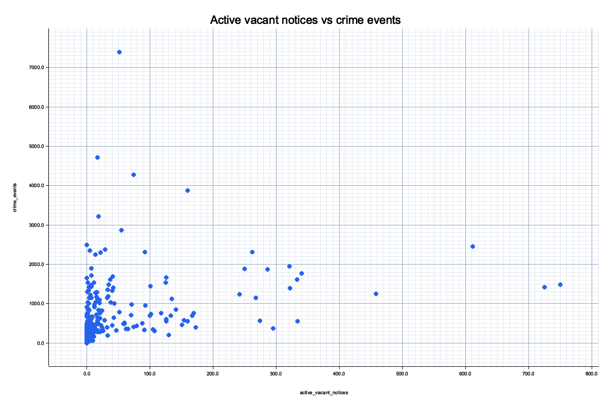
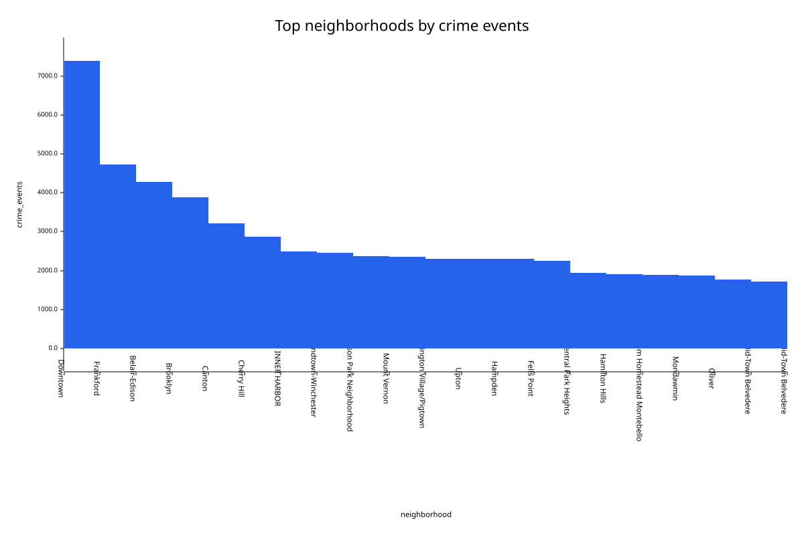

# csvprof Part 2: Baltimore Data Correlation

This project extends the Part 1 `csvprof` CSV profiler with `csvjoin`, which
correlates two Baltimore City open-data CSV exports by neighborhood, and
`csvplot`, which renders CSV columns as Plotters-backed PNG or SVG charts.

## Project Structure

```text
csvprof/
  Cargo.toml
  src/
    main.rs                 # Part 1 csvprof binary
    bin/csvjoin.rs          # Part 2 join/correlation binary
    bin/csvplot.rs          # Plotters-backed CSV visualization binary
    cli.rs                  # shared CLI defaults
    plot.rs                 # shared CSV plotting loader/rendering code
    profiler.rs             # shared streaming profiler
    report.rs               # shared markdown/json report rendering
    stats.rs                # shared stats traits and accumulators
    types.rs                # shared report/data types
    error.rs                # shared csvprof errors
  scripts/
    download-baltimore-data.sh
  data/
    nibrs_group_a_crime.csv
    vacant_building_notices.csv
  profiles/
    nibrs_group_a_crime_profile.md
    vacant_building_notices_profile.md
    joined_neighborhood_profile.md
  output/
    neighborhood_crime_vacancy_join.csv
```

## Dataset 1

**Name:** NIBRS Group A Crime Data

**Source URL:** <https://data.baltimorecity.gov/datasets/baltimore::nibrs-group-a-crime-data/about>

**CSV export:** <https://hub.arcgis.com/api/download/v1/items/204beefe92a645d79fdf0969957bbdf8/csv?layers=0>

**Description:** Baltimore Police Department Group A crime records starting on
January 1, 2022. The file includes incident time, crime description, weapon and
shooting markers, police geography, neighborhood, coordinates, and
`Total_Incidents`.

**Key Columns Used:** `Neighborhood`

**Supporting Columns Used:** `Description`, `Shooting`, `Total_Incidents`

## Dataset 2

**Name:** Vacant Building Notices

**Source URL:** <https://data.baltimorecity.gov/datasets/baltimore::vacant-building-notices/about>

**CSV export:** <https://hub.arcgis.com/api/download/v1/items/691d65a5f85640e6aaa46930bd9dc102/csv?layers=1>

**Description:** Current Vacant Building Notice points for Baltimore City. The
file includes notice number, notice date, cancellation and abatement fields,
housing market typology, council district, neighborhood, block/lot, and address.

**Key Columns Used:** `Neighborhood`

**Supporting Columns Used:** `NoticeNum`, `DateNotice`, `DateCancel`,
`DateAbate`

## Research Question

Do Baltimore neighborhoods with more active vacant building notices show
measurably higher NIBRS Group A crime counts during the 2022-present crime data
period than neighborhoods with few or no active vacant notices?

## Vacant Notices vs. Crime Events





## How To Run

Download current CSV exports:

```bash
./scripts/download-baltimore-data.sh
```

Profile both raw datasets with the Part 1 tool:

```bash
cargo run --bin csvprof -- data/nibrs_group_a_crime.csv --percentiles 25,75,90 \
  > profiles/nibrs_group_a_crime_profile.md

cargo run --bin csvprof -- data/vacant_building_notices.csv --percentiles 25,75,90 \
  > profiles/vacant_building_notices_profile.md
```

Join and profile the joined output:

```bash
cargo run --bin csvjoin -- \
  --crime data/nibrs_group_a_crime.csv \
  --vacant data/vacant_building_notices.csv \
  --output output/neighborhood_crime_vacancy_join.csv \
  --joined-profile profiles/joined_neighborhood_profile.md
```

Run tests:

```bash
cargo test
```

Visualize the joined output:

```bash
cargo run --bin csvplot -- output/neighborhood_crime_vacancy_join.csv \
  --x active_vacant_notices \
  --y crime_events \
  --kind scatter \
  --output output/vacancy_crime_scatter.png \
  --title "Active vacant notices vs crime events"

cargo run --bin csvplot -- output/neighborhood_crime_vacancy_join.csv \
  --x neighborhood \
  --y crime_events \
  --kind bar \
  --top 20 \
  --output output/top_neighborhood_crime.svg \
  --title "Top neighborhoods by crime events"
```

## Join Strategy

`csvjoin` uses a bounded-memory hash join by `Neighborhood`.

1. It reads the smaller Vacant Building Notices file first and aggregates rows
   into a `HashMap` keyed by a normalized neighborhood name.
2. It streams the larger crime file once, normalizes each crime neighborhood,
   and accumulates crime counts into the same map.
3. It writes one joined aggregate row per neighborhood instead of producing a
   many-to-many record join. This keeps memory proportional to the number of
   neighborhoods, not the number of input rows.

The binary reuses Part 1 code by importing `csvprof::profiler::Profiler`,
`ProfilerConfig`, `csvprof::report`, `OutputFormat`, and the shared null-marker
defaults. Joined-output profiling therefore uses the existing type inference
and report rendering instead of duplicating profiler logic.

## Answer

The analysis found a positive relationship between active vacant-building
notices and crime counts, but the relationship is not strong enough to treat as
causal.

The downloaded files contained 247,869 crime rows and 11,809 vacant-building
notice rows. After excluding crime rows without a usable neighborhood key,
`csvjoin` joined 192,579 crime rows and all 11,809 vacant-building notices
across 290 neighborhoods.

The Pearson correlation between active vacant notices and crime events was
0.311, which suggests a moderate positive association. The top vacancy quartile
of neighborhoods averaged 1,167.384 crime events, while the bottom vacancy
quartile averaged 140.959 crime events. That is an 8.282x difference in average
crime-event counts between the highest- and lowest-vacancy neighborhood groups.

Several high-vacancy neighborhoods also had high crime totals. Carrollton Ridge
had 750 active vacant notices and 1,481 crime events. Broadway East had 725
active vacant notices and 1,421 crime events. Sandtown-Winchester had 611 active
vacant notices and 2,455 crime events.

The relationship is not universal. Downtown had the highest crime-event total in
the joined output, with 7,388 crime events, but only 52 active vacant notices.
That indicates vacant-building notices are one useful neighborhood signal, not a
complete explanation for crime counts.

## Limitations

The crime file had 55,290 rows with missing or placeholder `Neighborhood`
values, and those rows could not participate in a key-based neighborhood join.

The analysis uses raw counts, not rates. Neighborhoods differ in population,
area, commercial activity, transit volume, and reporting intensity, so the
counts should not be interpreted as per-capita risk.

The time windows are not perfectly aligned. NIBRS crime records cover
2022-present, while the Vacant Building Notices file is a current open-notice
snapshot downloaded on April 24, 2026.

The result is correlational. A positive association does not prove that vacant
buildings cause crime, or that crime causes vacancy.
